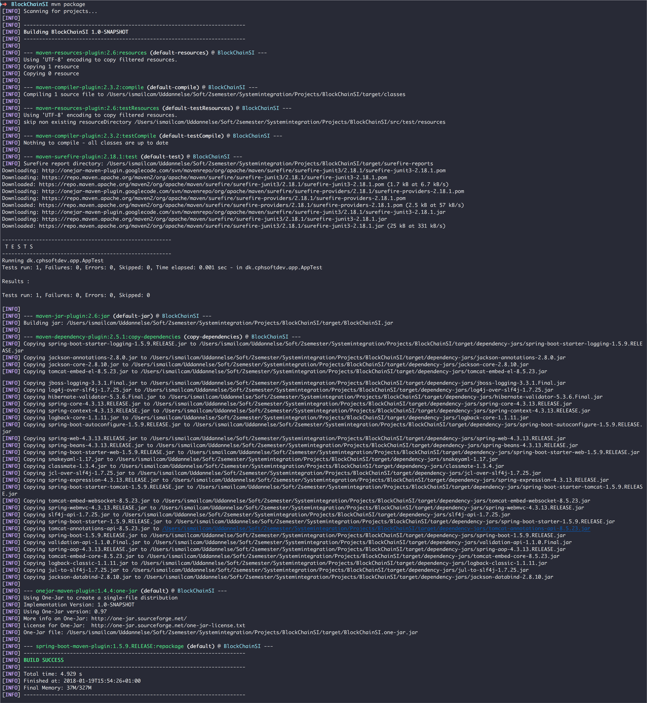
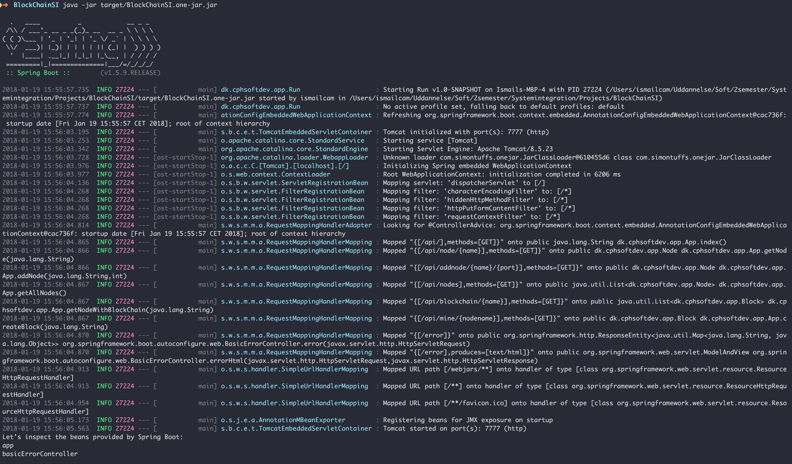
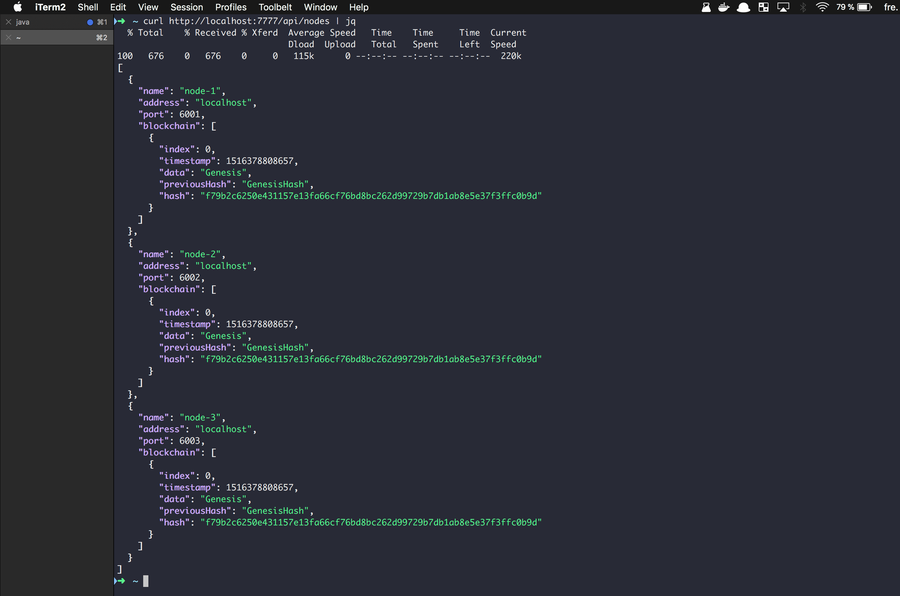
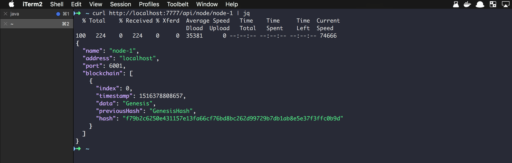
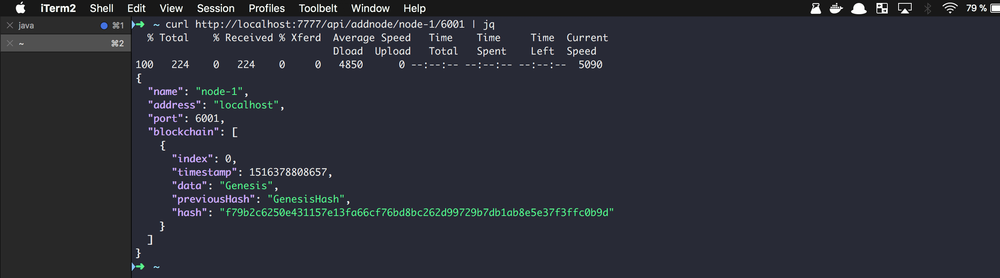
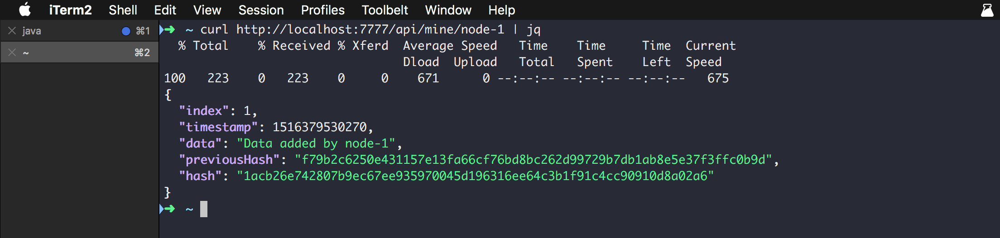
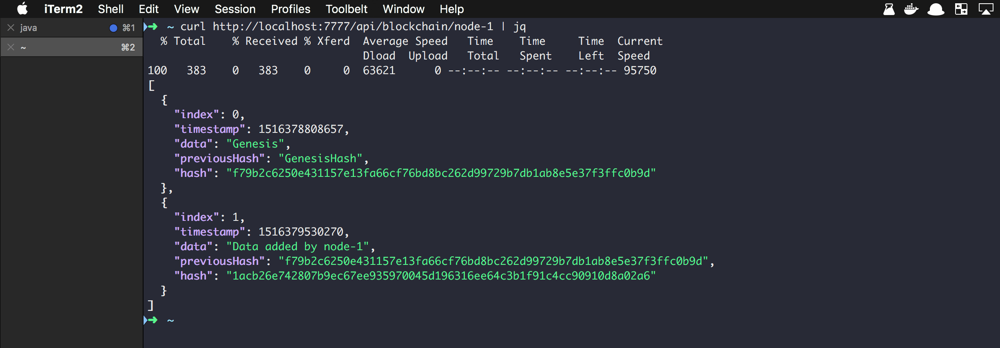

# BlockChai

### Requirements
* Java 1.8 >
* Apache Maven
----

### Getting started

1. Clone or just download the repository.
```bash
➜ git clone https://github.com/bigstepdenmark/BlockChain.git
```

2. Build the project
```bash
➜ mvn package
```


3. Start the application (run the generated .jar file)
```bash
➜ java -jar target/BlockChainSI.one-jar.jar
```


---

### Endpoints

Get all nodes (method=GET)
```
➜ http://localhost:7777/api/nodes
```


Get the node by given node name (method=GET)
```
➜ http://localhost:7777/api/node/{name}
```


Create new node (method=GET)
```
➜ http://localhost:7777/api/addnode/{name}/{port}
```


Create new block by given node name (method=GET)
```
➜ http://localhost:7777/api/mine/{name}
```


Get all blockchains by given node name (method=GET)
```
➜ http://localhost:7777/api/blockchain/{name}
```


